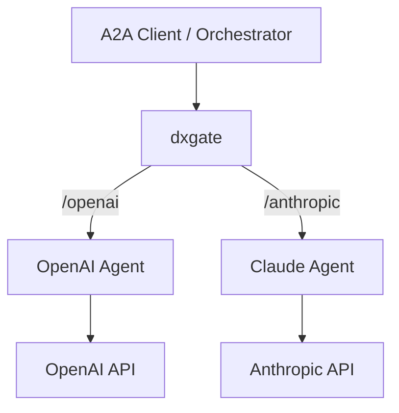

# A2A Services

dxgate faces A2A Servers. It does not turn OpenAI or Anthropic APIs into A2A Agents. Each Agent calls its own LLM; dxgate handles Agent Cards, JSON-RPC, policies, and task affinity.



## 1. Two A2A Servers

Both applications implement an A2A Server and expose an Agent Card plus a JSON-RPC endpoint:

```yaml
apiVersion: v1
kind: Service
metadata:
  name: openai-agent
spec:
  selector:
    app: openai-agent
  ports:
    - port: 9090
---
apiVersion: v1
kind: Service
metadata:
  name: anthropic-agent
spec:
  selector:
    app: anthropic-agent
  ports:
    - port: 9090
```

The OpenAI Agent Pod can read its LLM key from a Secret:

```yaml
env:
  - name: OPENAI_API_KEY
    valueFrom:
      secretKeyRef:
        name: llm-keys
        key: OPENAI_API_KEY
  - name: MODEL
    value: gpt-5
```

The Anthropic Agent does the same:

```yaml
env:
  - name: ANTHROPIC_API_KEY
    valueFrom:
      secretKeyRef:
        name: llm-keys
        key: ANTHROPIC_API_KEY
  - name: MODEL
    value: claude-opus-4-6
```

## 2. Register with the mesh

The old `DxgateBackend` is gone. One `v1alpha3/DxgateService` describes each Agent:

```yaml
apiVersion: networking.dubbo.apache.org/v1alpha3
kind: DxgateService
metadata:
  name: openai-agent
spec:
  a2a:
    backendRef:
      name: openai-agent
    port: 9090
    agent: openai
---
apiVersion: networking.dubbo.apache.org/v1alpha3
kind: DxgateService
metadata:
  name: anthropic-agent
spec:
  a2a:
    backendRef:
      name: anthropic-agent
    port: 9090
    agent: anthropic
```

Use `backendRef` for an in-cluster Agent. An external Agent without a Kubernetes Service can use `host` instead. Exactly one is allowed.

## 3. A2A routes

```yaml
apiVersion: gateway.networking.k8s.io/v1
kind: HTTPRoute
metadata:
  name: agents
spec:
  parentRefs:
    - name: dxgate-proxy
      namespace: dubbo-system
  rules:
    - matches:
        - path:
            type: PathPrefix
            value: /openai
      filters:
        - type: URLRewrite
          urlRewrite:
            path:
              type: ReplacePrefixMatch
              replacePrefixMatch: /
      backendRefs:
        - name: openai-agent
          group: networking.dubbo.apache.org
          kind: DxgateService
    - matches:
        - path:
            type: PathPrefix
            value: /anthropic
      filters:
        - type: URLRewrite
          urlRewrite:
            path:
              type: ReplacePrefixMatch
              replacePrefixMatch: /
      backendRefs:
        - name: anthropic-agent
          group: networking.dubbo.apache.org
          kind: DxgateService
```

Read the Agent Cards:

```bash
curl http://<gateway>/openai/.well-known/agent-card.json
curl http://<gateway>/anthropic/.well-known/agent-card.json
```

An A2A Client can discover both Agents' skills, send messages, inspect or cancel tasks, and continue streaming tasks.

## Agent Cards

dxgate rewrites the scheme and authority in absolute Agent Card `url` and `additionalInterfaces[].url` values to the gateway address while preserving paths. Internal cluster addresses do not leak, and clients cannot bypass gateway policies.

## Task affinity

dxgate extracts task IDs from A2A JSON-RPC requests and responses. Later `tasks/get`, `tasks/cancel`, `tasks/resubscribe`, and continuation messages stay on the backend that created the task. Streaming responses bind as soon as the first task ID appears in SSE.

## Paths

Standard paths are `/.well-known/agent-card.json`, `/a2a`, and `/a2a/*`. Use an HTTPRoute `URLRewrite` for custom entry paths; replacement happens before protocol processing.

See the [unified DxgateService API](service.md) for every field.

A2A reference: [Agent Card discovery](https://a2a-protocol.org/latest/topics/agent-discovery/).
