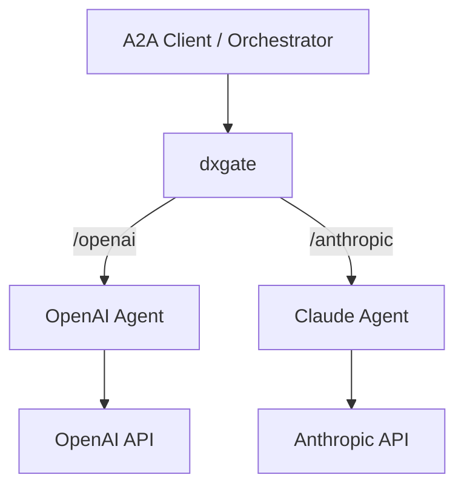

# A2A Service

dxgate 面向 A2A Server，不会把 OpenAI 或 Anthropic API 自动变成 A2A Agent。Agent 自己调用 LLM，dxgate 负责 Agent Card、JSON-RPC、策略和任务亲和。



## 1. 两个 A2A Server

两个应用都要实现 A2A Server，并暴露 Agent Card 与 JSON-RPC endpoint：

```yaml
apiVersion: v1
kind: Service
metadata:
  name: openai-agent
spec:
  selector:
    app: openai-agent
  ports:
    - port: 9090
---
apiVersion: v1
kind: Service
metadata:
  name: anthropic-agent
spec:
  selector:
    app: anthropic-agent
  ports:
    - port: 9090
```

OpenAI Agent Pod 可以从 Secret 注入自己的 LLM key：

```yaml
env:
  - name: OPENAI_API_KEY
    valueFrom:
      secretKeyRef:
        name: llm-keys
        key: OPENAI_API_KEY
  - name: MODEL
    value: gpt-5
```

Anthropic Agent 同理：

```yaml
env:
  - name: ANTHROPIC_API_KEY
    valueFrom:
      secretKeyRef:
        name: llm-keys
        key: ANTHROPIC_API_KEY
  - name: MODEL
    value: claude-opus-4-6
```

## 2. 注册到网格

旧 `DxgateBackend` 不再使用。每个 Agent 由一个 `v1alpha3/DxgateService` 描述：

```yaml
apiVersion: networking.dubbo.apache.org/v1alpha3
kind: DxgateService
metadata:
  name: openai-agent
spec:
  a2a:
    backendRef:
      name: openai-agent
    port: 9090
    agent: openai
---
apiVersion: networking.dubbo.apache.org/v1alpha3
kind: DxgateService
metadata:
  name: anthropic-agent
spec:
  a2a:
    backendRef:
      name: anthropic-agent
    port: 9090
    agent: anthropic
```

集群内 Agent 使用 `backendRef`；没有 Kubernetes Service 的外部 Agent 可以改用 `host`。两者只能选择一个。

## 3. A2A 路由

```yaml
apiVersion: gateway.networking.k8s.io/v1
kind: HTTPRoute
metadata:
  name: agents
spec:
  parentRefs:
    - name: dxgate-proxy
      namespace: dubbo-system
  rules:
    - matches:
        - path:
            type: PathPrefix
            value: /openai
      filters:
        - type: URLRewrite
          urlRewrite:
            path:
              type: ReplacePrefixMatch
              replacePrefixMatch: /
      backendRefs:
        - name: openai-agent
          group: networking.dubbo.apache.org
          kind: DxgateService
    - matches:
        - path:
            type: PathPrefix
            value: /anthropic
      filters:
        - type: URLRewrite
          urlRewrite:
            path:
              type: ReplacePrefixMatch
              replacePrefixMatch: /
      backendRefs:
        - name: anthropic-agent
          group: networking.dubbo.apache.org
          kind: DxgateService
```

读取 Agent Card：

```bash
curl http://<gateway>/openai/.well-known/agent-card.json
curl http://<gateway>/anthropic/.well-known/agent-card.json
```

A2A Client 读取两个 Agent Card 后，可以按 skill 发送消息、查询任务、取消任务或继续流式任务。

## Agent Card

dxgate 把 Agent Card 中绝对 `url` 与 `additionalInterfaces[].url` 的协议和主机改成客户端访问网关时的地址，保留路径。这样不会泄露集群内地址，客户端也不会绕过网关策略。

## 任务亲和

dxgate 从 A2A JSON-RPC 请求与响应提取 task ID，把后续 `tasks/get`、`tasks/cancel`、`tasks/resubscribe` 和续接消息固定到最初处理它的后端。流式响应会边转发边识别 task ID，不必等待 SSE 结束。

## 路径

标准路径是 `/.well-known/agent-card.json`、`/a2a` 与 `/a2a/*`。需要自定义入口时使用 HTTPRoute `URLRewrite`，数据面在协议处理前执行路径替换。

完整字段见[统一 DxgateService API](service.md)。

A2A 标准参考：[Agent Card discovery](https://a2a-protocol.org/latest/topics/agent-discovery/)。
