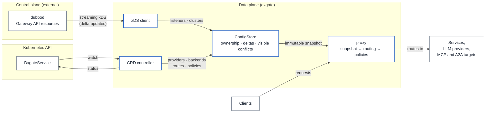

# Gateway architecture

dxgate is the data plane and `dubbod` is its only control plane. Ordinary HTTP and AI backends enter one mesh configuration path.

## API boundary

- Ordinary HTTP, gRPC, and Dubbo Triple backends remain core Kubernetes `Service` objects.
- OpenAI, Anthropic, MCP, and A2A backends all use
  `networking.dubbo.apache.org/v1alpha3` `DxgateService`.
- Gateway API `HTTPRoute.backendRefs` references both kinds.
- `Dxgate`, `DxgateBackend`, `DxgateRoute`, and `DxgatePolicy` are no longer part of the runtime path.

## Control plane

`dubbod` watches `Gateway`, `HTTPRoute`, `Service`, and `DxgateService`, validates their types and references, then compiles ordinary and agent routes into the same RDS `RouteConfiguration`. A `DxgateService` update triggers a new xDS push without restarting the data plane.

Cross-namespace `DxgateService` references are currently rejected. Credential references stay in the `DxgateService` namespace, avoiding cluster-wide Secret access.

## Data plane

dxgate consumes only xDS from `dubbod`. It watches no private routing CRDs and merges no second configuration API. Its only Kubernetes access is reading same-namespace Secret values already referenced by RDS; its ServiceAccount has only `secrets/get`.

Each RDS update produces an immutable runtime snapshot. Ordinary HTTP/gRPC uses listeners, virtual hosts, and clusters directly. LLM, MCP, and A2A parse protocol fields before applying authentication, rate and token limits, timeouts, retries, and header transforms.

dxgate subscribes to SDS `default` and `ROOTCA` resources over the same ADS connection. Validated rotations enter the immutable snapshot before ACK; invalid rotations are NACKed while the last valid certificate remains active. SDS private keys are redacted from `/debug/config`.

See [the unified DxgateService API](service.md) for complete resources.
