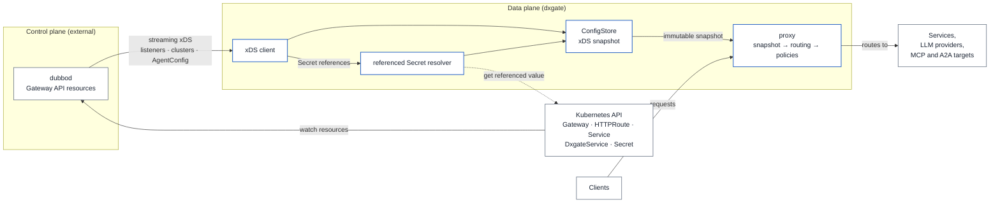

# 网关架构

dxgate 是数据面，`dubbod` 是唯一控制面。普通 HTTP 后端与 AI 后端都从 Kubernetes API 进入同一条网格配置链。

## API 边界

- 普通 HTTP、gRPC、Dubbo Triple 后端继续使用核心 Kubernetes `Service`。
- OpenAI、Anthropic、MCP、A2A 后端统一使用
  `networking.dubbo.apache.org/v1alpha3` `DxgateService`。
- 两类后端都由 Gateway API `HTTPRoute.backendRefs` 引用。
- `Dxgate`、`DxgateBackend`、`DxgateRoute`、`DxgatePolicy` 不再存在于运行链路。

## 控制面

`dubbod` watch `Gateway`、`HTTPRoute`、`Service` 与 `DxgateService`，校验类型和引用，把普通路由与智能体路由编译进同一个 RDS `RouteConfiguration`。`DxgateService` 更新会触发新的 xDS push；数据面无需重启。

跨命名空间 `DxgateService` 引用目前拒绝。凭据引用也固定在 `DxgateService` 所在命名空间，避免给数据面集群级 Secret 权限。

## 数据面

dxgate 只消费 `dubbod` 的 xDS。它不 watch 独立路由 CRD，也不在数据面合并两套配置。唯一的 Kubernetes 访问是读取 RDS 已引用的同命名空间 Secret 值；ServiceAccount 只有 `secrets/get`。

RDS 更新会生成一份不可变运行时快照。普通 HTTP/gRPC 直接按 listener、virtual host、cluster 转发；LLM、MCP、A2A 会解析协议字段，再执行认证、限流、Token 预算、超时、重试和请求头变换。

完整资源写法见[统一 DxgateService API](service.md)。
