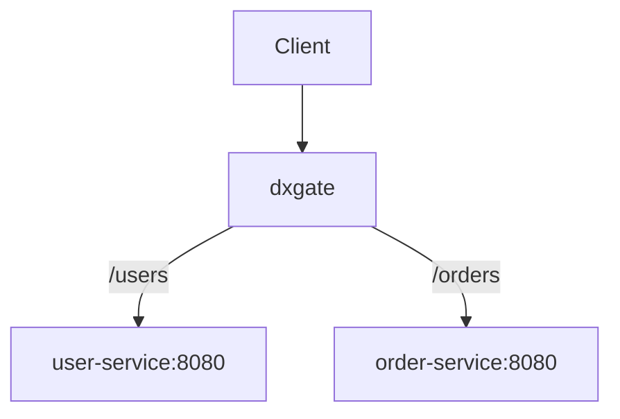

# Ordinary Kubernetes Services

Ordinary HTTP backends do not require a `DxgateService`. `HTTPRoute.backendRefs` references core Kubernetes `Service` objects directly. `dubbod` compiles routes and endpoints into xDS; dxgate only forwards traffic.



## Services

```yaml
apiVersion: v1
kind: Service
metadata:
  name: user-service
spec:
  selector:
    app: user-service
  ports:
    - port: 8080
      targetPort: 8080
---
apiVersion: v1
kind: Service
metadata:
  name: order-service
spec:
  selector:
    app: order-service
  ports:
    - port: 8080
      targetPort: 8080
```

## HTTPRoute

Each rule points to its Service:

```yaml
apiVersion: gateway.networking.k8s.io/v1
kind: HTTPRoute
metadata:
  name: api
  namespace: default
spec:
  parentRefs:
    - name: dxgate-proxy
      namespace: dubbo-system
  rules:
    - matches:
        - path:
            type: PathPrefix
            value: /users
      backendRefs:
        - name: user-service
          port: 8080
    - matches:
        - path:
            type: PathPrefix
            value: /orders
      backendRefs:
        - name: order-service
          port: 8080
```

Call both routes:

```bash
curl http://<gateway>/users/123
curl http://<gateway>/orders/456
```

The full path is preserved by default. If `user-service` expects `/123` instead of `/users/123`, add the standard Gateway API `URLRewrite` filter to the `/users` rule:

```yaml
filters:
  - type: URLRewrite
    urlRewrite:
      path:
        type: ReplacePrefixMatch
        replacePrefixMatch: /
```

## Backend types

| Traffic | Backend resource |
| --- | --- |
| Ordinary HTTP | Kubernetes `Service` |
| LLM | `DxgateService.ai` |
| MCP | `DxgateService.mcp` |
| A2A | `DxgateService.a2a` |

`HTTPRoute` references both ordinary Services and `DxgateService` objects, but one rule cannot mix the two backend kinds.
