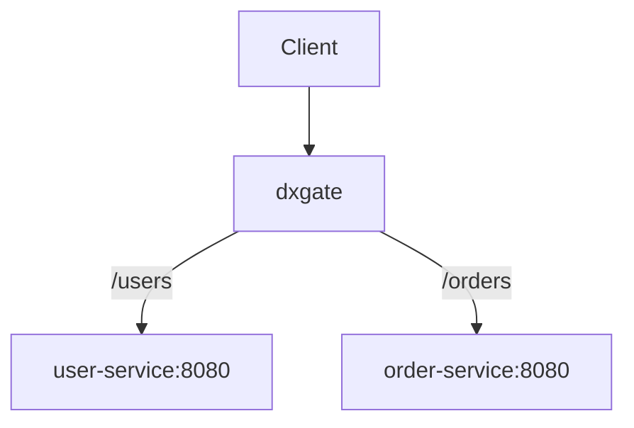

# 普通 Kubernetes Service

普通 HTTP 后端不创建 `DxgateService`。`HTTPRoute.backendRefs` 直接引用核心 Kubernetes `Service`，`dubbod` 把路由与端点编译为 xDS，dxgate 只负责转发。



## Service

```yaml
apiVersion: v1
kind: Service
metadata:
  name: user-service
spec:
  selector:
    app: user-service
  ports:
    - port: 8080
      targetPort: 8080
---
apiVersion: v1
kind: Service
metadata:
  name: order-service
spec:
  selector:
    app: order-service
  ports:
    - port: 8080
      targetPort: 8080
```

## HTTPRoute

每条 rule 指向对应 Service：

```yaml
apiVersion: gateway.networking.k8s.io/v1
kind: HTTPRoute
metadata:
  name: api
  namespace: default
spec:
  parentRefs:
    - name: dxgate-proxy
      namespace: dubbo-system
  rules:
    - matches:
        - path:
            type: PathPrefix
            value: /users
      backendRefs:
        - name: user-service
          port: 8080
    - matches:
        - path:
            type: PathPrefix
            value: /orders
      backendRefs:
        - name: order-service
          port: 8080
```

调用：

```bash
curl http://<gateway>/users/123
curl http://<gateway>/orders/456
```

默认向上游保留完整路径。如果 `user-service` 希望收到 `/123` 而不是 `/users/123`，在 `/users` rule 中加入标准 Gateway API `URLRewrite`：

```yaml
filters:
  - type: URLRewrite
    urlRewrite:
      path:
        type: ReplacePrefixMatch
        replacePrefixMatch: /
```

## 后端类型

| 流量 | 后端资源 |
| --- | --- |
| 普通 HTTP | Kubernetes `Service` |
| LLM | `DxgateService.ai` |
| MCP | `DxgateService.mcp` |
| A2A | `DxgateService.a2a` |

普通 Service 与 `DxgateService` 都由 `HTTPRoute` 引用，但同一 rule 不能混用两种后端类型。
