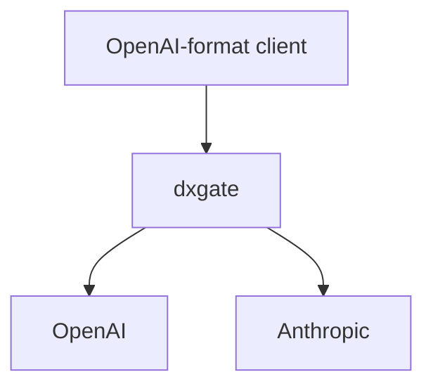

# LLM Services

Clients can always use the OpenAI wire format. `DxgateService.spec.ai.provider` selects OpenAI or Anthropic; dxgate translates Anthropic requests, responses, and SSE events.



## 1. Provider Secrets

The Secret and `DxgateService` must share a namespace. Store the raw key. dxgate produces `Authorization: Bearer <key>` for OpenAI and `x-api-key` plus `anthropic-version` for Anthropic.

```bash
kubectl -n dubbo-system create secret generic openai-secret \
  --from-literal=Authorization="$OPENAI_API_KEY"

kubectl -n dubbo-system create secret generic anthropic-secret \
  --from-literal=Authorization="$ANTHROPIC_API_KEY"
```

## 2. OpenAI

Omitting `models` accepts any model submitted by the client:

```yaml
apiVersion: networking.dubbo.apache.org/v1alpha3
kind: DxgateService
metadata:
  name: openai
  namespace: dubbo-system
spec:
  ai:
    provider:
      openai: {}
      credential:
        name: openai-secret
        key: Authorization
    routes:
      /v1/chat/completions: COMPLETIONS
      /v1/responses: RESPONSES
```

For a private OpenAI-compatible service or no-key testing, set `spec.ai.endpoint`, for example `http://mock-openai:8081/v1`.

## 3. Anthropic

`provider.anthropic.model` supplies the default when the client omits a model. The client still sends OpenAI Chat Completions:

```yaml
apiVersion: networking.dubbo.apache.org/v1alpha3
kind: DxgateService
metadata:
  name: anthropic
  namespace: dubbo-system
spec:
  ai:
    provider:
      anthropic:
        model: claude-opus-4-6
      credential:
        name: anthropic-secret
        key: Authorization
    routes:
      /v1/chat/completions: COMPLETIONS
```

dxgate translates the request to Anthropic Messages and translates the response back to an OpenAI chat-completion. `usage.input_tokens` and `usage.output_tokens` become `prompt_tokens` and `completion_tokens`.

## 4. HTTPRoute

Use standard Gateway API `URLRewrite` filters for custom entry paths. Both paths below become the OpenAI Chat Completions path:

```yaml
apiVersion: gateway.networking.k8s.io/v1
kind: HTTPRoute
metadata:
  name: llm
  namespace: dubbo-system
spec:
  parentRefs:
    - name: dxgate-proxy
  rules:
    - matches:
        - path:
            type: PathPrefix
            value: /openai
      filters:
        - type: URLRewrite
          urlRewrite:
            path:
              type: ReplacePrefixMatch
              replacePrefixMatch: /v1/chat/completions
      backendRefs:
        - name: openai
          group: networking.dubbo.apache.org
          kind: DxgateService
    - matches:
        - path:
            type: PathPrefix
            value: /anthropic
      filters:
        - type: URLRewrite
          urlRewrite:
            path:
              type: ReplacePrefixMatch
              replacePrefixMatch: /v1/chat/completions
      backendRefs:
        - name: anthropic
          group: networking.dubbo.apache.org
          kind: DxgateService
```

## 5. Calls

```bash
kubectl apply -f openai.yaml
kubectl apply -f anthropic.yaml
kubectl apply -f llm-route.yaml
kubectl port-forward -n dubbo-system deployment/dxgate-proxy 8080:80
```

OpenAI:

```bash
curl http://localhost:8080/openai \
  -H 'Content-Type: application/json' \
  -d '{"model":"gpt-5","messages":[{"role":"user","content":"hello"}]}'
```

Anthropic, still using OpenAI format:

```bash
curl http://localhost:8080/anthropic \
  -H 'Content-Type: application/json' \
  -d '{"model":"","messages":[{"role":"user","content":"hello"}]}'
```

`policies.auth` authenticates clients calling the gateway; it is not the provider key. Provider keys belong in `spec.ai.provider.credential`. See the [unified DxgateService API](service.md) for every field.

Codex subscription vs API wiring, and the bill: [cost control](cost-control.md).
