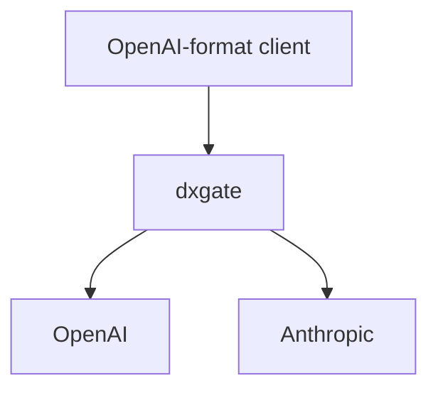

# LLM Service

客户端始终可以使用 OpenAI 格式。`DxgateService.spec.ai.provider` 选择 OpenAI 或 Anthropic；Anthropic 后端由 dxgate 转换请求、响应和 SSE 事件。



## 1. Provider Secret

Secret 与 `DxgateService` 必须位于同一命名空间。Secret 保存原始 key；dxgate 对 OpenAI 自动生成 `Authorization: Bearer <key>`，对 Anthropic 生成 `x-api-key` 并补充 `anthropic-version`。

```bash
kubectl -n dubbo-system create secret generic openai-secret \
  --from-literal=Authorization="$OPENAI_API_KEY"

kubectl -n dubbo-system create secret generic anthropic-secret \
  --from-literal=Authorization="$ANTHROPIC_API_KEY"
```

## 2. OpenAI

不配置 `models` 表示接受客户端提交的任意模型名：

```yaml
apiVersion: networking.dubbo.apache.org/v1alpha3
kind: DxgateService
metadata:
  name: openai
  namespace: dubbo-system
spec:
  ai:
    provider:
      openai: {}
      credential:
        name: openai-secret
        key: Authorization
    routes:
      /v1/chat/completions: COMPLETIONS
      /v1/responses: RESPONSES
```

私有 OpenAI-compatible 服务或无付费 key 测试可以设置 `spec.ai.endpoint`，例如 `http://mock-openai:8081/v1`。

## 3. Anthropic

`provider.anthropic.model` 是客户端不指定模型时的默认值。客户端仍发送 OpenAI Chat Completions 格式：

```yaml
apiVersion: networking.dubbo.apache.org/v1alpha3
kind: DxgateService
metadata:
  name: anthropic
  namespace: dubbo-system
spec:
  ai:
    provider:
      anthropic:
        model: claude-opus-4-6
      credential:
        name: anthropic-secret
        key: Authorization
    routes:
      /v1/chat/completions: COMPLETIONS
```

dxgate 把请求转换为 Anthropic Messages API，再把响应转换回 OpenAI chat-completion。`usage.input_tokens`、`usage.output_tokens` 分别映射为 `prompt_tokens`、`completion_tokens`。

## 4. HTTPRoute

自定义入口路径使用标准 Gateway API `URLRewrite`，两条路径都改写为 OpenAI Chat Completions 路径：

```yaml
apiVersion: gateway.networking.k8s.io/v1
kind: HTTPRoute
metadata:
  name: llm
  namespace: dubbo-system
spec:
  parentRefs:
    - name: dxgate-proxy
  rules:
    - matches:
        - path:
            type: PathPrefix
            value: /openai
      filters:
        - type: URLRewrite
          urlRewrite:
            path:
              type: ReplacePrefixMatch
              replacePrefixMatch: /v1/chat/completions
      backendRefs:
        - name: openai
          group: networking.dubbo.apache.org
          kind: DxgateService
    - matches:
        - path:
            type: PathPrefix
            value: /anthropic
      filters:
        - type: URLRewrite
          urlRewrite:
            path:
              type: ReplacePrefixMatch
              replacePrefixMatch: /v1/chat/completions
      backendRefs:
        - name: anthropic
          group: networking.dubbo.apache.org
          kind: DxgateService
```

## 5. 调用

```bash
kubectl apply -f openai.yaml
kubectl apply -f anthropic.yaml
kubectl apply -f llm-route.yaml
kubectl port-forward -n dubbo-system deployment/dxgate-proxy 8080:80
```

OpenAI：

```bash
curl http://localhost:8080/openai \
  -H 'Content-Type: application/json' \
  -d '{"model":"gpt-5","messages":[{"role":"user","content":"hello"}]}'
```

Anthropic，仍使用 OpenAI 格式：

```bash
curl http://localhost:8080/anthropic \
  -H 'Content-Type: application/json' \
  -d '{"model":"","messages":[{"role":"user","content":"hello"}]}'
```

`policies.auth` 是客户端访问网关的认证，不是 Provider key。Provider key 必须放在 `spec.ai.provider.credential`。完整字段见[统一 DxgateService API](service.md)。
