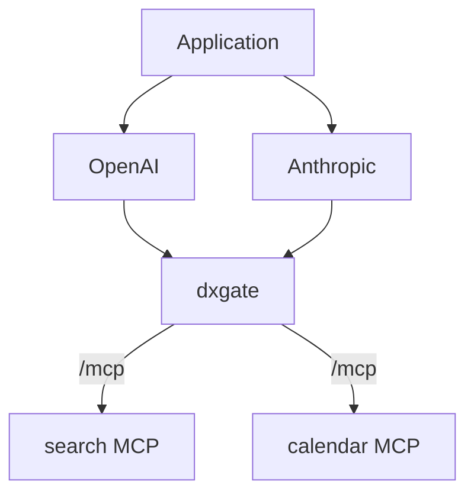

# MCP Services

OpenAI, Anthropic, and custom Agents can use the MCP endpoint exposed by dxgate as a remote tool server. dxgate handles routing, tool federation, authentication, RBAC, rate limits, and auditing; the model decides when to call a tool.



## 1. MCP Servers

Expose each MCP Server with an ordinary Kubernetes Service. The referencing `DxgateService.spec.mcp` declares the protocol, so the old `DxgateBackend` is not required:

```yaml
apiVersion: v1
kind: Service
metadata:
  name: search-mcp
spec:
  selector:
    app: search-mcp
  ports:
    - port: 8080
      targetPort: 8080
---
apiVersion: v1
kind: Service
metadata:
  name: calendar-mcp
spec:
  selector:
    app: calendar-mcp
  ports:
    - port: 8080
      targetPort: 8080
```

## 2. MCP federation

One `DxgateService.spec.mcp` can federate multiple Services behind one endpoint:

```yaml
apiVersion: networking.dubbo.apache.org/v1alpha3
kind: DxgateService
metadata:
  name: tools
spec:
  mcp:
    targets:
      - name: search
        static:
          backendRef:
            name: search-mcp
          port: 8080
        tools: [search]
      - name: calendar
        static:
          backendRef:
            name: calendar-mcp
          port: 8080
        tools: [calendar]
```

Each target's `backendRef` is an ordinary Kubernetes Service.

## 3. HTTPRoute

```yaml
apiVersion: gateway.networking.k8s.io/v1
kind: HTTPRoute
metadata:
  name: mcp
spec:
  parentRefs:
    - name: dxgate-proxy
      namespace: dubbo-system
  rules:
    - matches:
        - path:
            type: PathPrefix
            value: /mcp
      backendRefs:
        - name: tools
          group: networking.dubbo.apache.org
          kind: DxgateService
```

The remote endpoint is `https://ai.example.com/mcp`.

## Runtime behavior

- `/mcp` and `/mcp/*` use MCP processing.
- Requests without a specific tool, including `initialize` and `tools/list`, can reach every target.
- `tools/call` selects a target from its declared `tools`.
- `mcp-session-id` pins later requests to the initially selected target.
- `tools/list`, `prompts/list`, `resources/list`, and template lists merge results and pagination across targets.
- Duplicate tool names become `{target}__{name}` and are restored before forwarding.

## 4. Direct verification

List federated tools:

```bash
curl https://ai.example.com/mcp \
  -H 'Content-Type: application/json' \
  -d '{"jsonrpc":"2.0","id":1,"method":"tools/list","params":{}}'
```

Call a tool:

```bash
curl https://ai.example.com/mcp \
  -H 'Content-Type: application/json' \
  -d '{"jsonrpc":"2.0","id":2,"method":"tools/call","params":{"name":"search","arguments":{"query":"order 12345"}}}'
```

## 5. OpenAI remote MCP

```python
from openai import OpenAI

client = OpenAI()
response = client.responses.create(
    model="gpt-5",
    input="Look up order 12345",
    tools=[{
        "type": "mcp",
        "server_label": "company-tools",
        "server_url": "https://ai.example.com/mcp",
    }],
)
print(response.output_text)
```

## 6. Anthropic using the same MCP endpoint

```python
import anthropic

client = anthropic.Anthropic()
response = client.beta.messages.create(
    model="claude-opus-4-6",
    max_tokens=1024,
    messages=[{"role": "user", "content": "Look up order 12345"}],
    mcp_servers=[{
        "type": "url",
        "name": "company-tools",
        "url": "https://ai.example.com/mcp",
    }],
    tools=[{
        "type": "mcp_toolset",
        "mcp_server_name": "company-tools",
    }],
    betas=["mcp-client-2025-11-20"],
)
```

The Claude MCP connector currently requires the `mcp-client-2025-11-20` beta. See the [unified DxgateService API](service.md) for policy fields. Enable TLS and client authentication on public MCP endpoints.

External API references: [OpenAI remote MCP](https://platform.openai.com/docs/guides/tools-remote-mcp) and the [Claude MCP connector](https://platform.claude.com/docs/en/agents-and-tools/mcp-connector).
