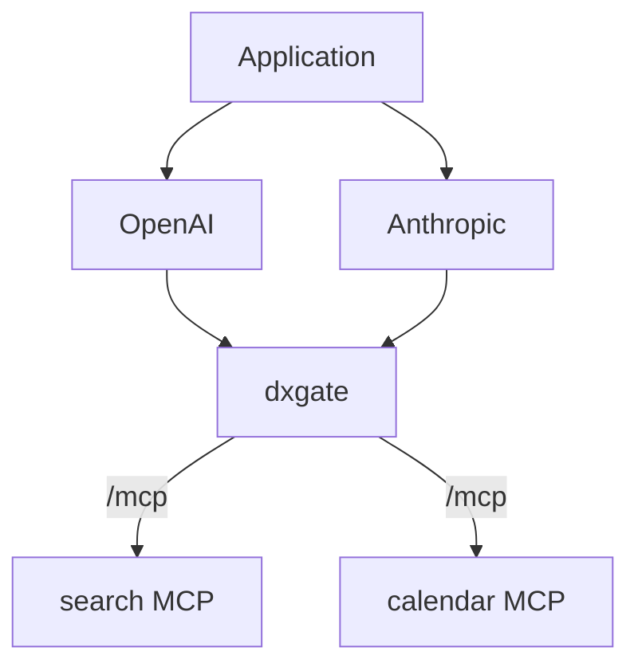

# MCP Service

OpenAI、Anthropic 或自建 Agent 都可以把 dxgate 暴露的 MCP endpoint 当成远程工具服务器。dxgate 负责路由、tool federation、认证、RBAC、限流和审计；模型负责决定何时调用工具。



## 1. MCP Server

MCP Server 仍用普通 Kubernetes Service 暴露。协议类型由引用它的 `DxgateService.spec.mcp` 声明，因此不需要旧 `DxgateBackend`：

```yaml
apiVersion: v1
kind: Service
metadata:
  name: search-mcp
spec:
  selector:
    app: search-mcp
  ports:
    - port: 8080
      targetPort: 8080
---
apiVersion: v1
kind: Service
metadata:
  name: calendar-mcp
spec:
  selector:
    app: calendar-mcp
  ports:
    - port: 8080
      targetPort: 8080
```

## 2. MCP federation

一个 `DxgateService.spec.mcp` 可以把多个 Service 联合成一个入口：

```yaml
apiVersion: networking.dubbo.apache.org/v1alpha3
kind: DxgateService
metadata:
  name: tools
spec:
  mcp:
    targets:
      - name: search
        static:
          backendRef:
            name: search-mcp
          port: 8080
        tools: [search]
      - name: calendar
        static:
          backendRef:
            name: calendar-mcp
          port: 8080
        tools: [calendar]
```

每个 target 的 `backendRef` 是普通 Kubernetes Service。

## 3. HTTPRoute

```yaml
apiVersion: gateway.networking.k8s.io/v1
kind: HTTPRoute
metadata:
  name: mcp
spec:
  parentRefs:
    - name: dxgate-proxy
      namespace: dubbo-system
  rules:
    - matches:
        - path:
            type: PathPrefix
            value: /mcp
      backendRefs:
        - name: tools
          group: networking.dubbo.apache.org
          kind: DxgateService
```

远程入口为 `https://ai.example.com/mcp`。

## 运行行为

- `/mcp` 与 `/mcp/*` 按 MCP 处理。
- `initialize`、`tools/list` 等未指定工具的请求可访问全部 target。
- `tools/call` 按 `tools` 声明选择 target。
- `mcp-session-id` 把后续请求固定到首次选中的 target。
- `tools/list`、`prompts/list`、`resources/list` 与模板列表会跨 target 聚合并处理分页。
- 重名工具暴露为 `{target}__{name}`，调用时自动还原并发往对应 target。

## 4. 直接验证

列出 federation 中的工具：

```bash
curl https://ai.example.com/mcp \
  -H 'Content-Type: application/json' \
  -d '{"jsonrpc":"2.0","id":1,"method":"tools/list","params":{}}'
```

调用工具：

```bash
curl https://ai.example.com/mcp \
  -H 'Content-Type: application/json' \
  -d '{"jsonrpc":"2.0","id":2,"method":"tools/call","params":{"name":"search","arguments":{"query":"order 12345"}}}'
```

## 5. OpenAI 使用远程 MCP

```python
from openai import OpenAI

client = OpenAI()
response = client.responses.create(
    model="gpt-5",
    input="查询订单 12345 的状态",
    tools=[{
        "type": "mcp",
        "server_label": "company-tools",
        "server_url": "https://ai.example.com/mcp",
    }],
)
print(response.output_text)
```

## 6. Anthropic 使用同一个 MCP

```python
import anthropic

client = anthropic.Anthropic()
response = client.beta.messages.create(
    model="claude-opus-4-6",
    max_tokens=1024,
    messages=[{"role": "user", "content": "查询订单 12345 的状态"}],
    mcp_servers=[{
        "type": "url",
        "name": "company-tools",
        "url": "https://ai.example.com/mcp",
    }],
    tools=[{
        "type": "mcp_toolset",
        "mcp_server_name": "company-tools",
    }],
    betas=["mcp-client-2025-11-20"],
)
```

Claude MCP connector 当前需要 `mcp-client-2025-11-20` beta。完整策略见[统一 DxgateService API](service.md)。生产环境应在公网 MCP endpoint 上启用 TLS 和客户端认证。

外部接口参考：[OpenAI remote MCP](https://platform.openai.com/docs/guides/tools-remote-mcp)；[Claude MCP connector](https://platform.claude.com/docs/en/agents-and-tools/mcp-connector)。
